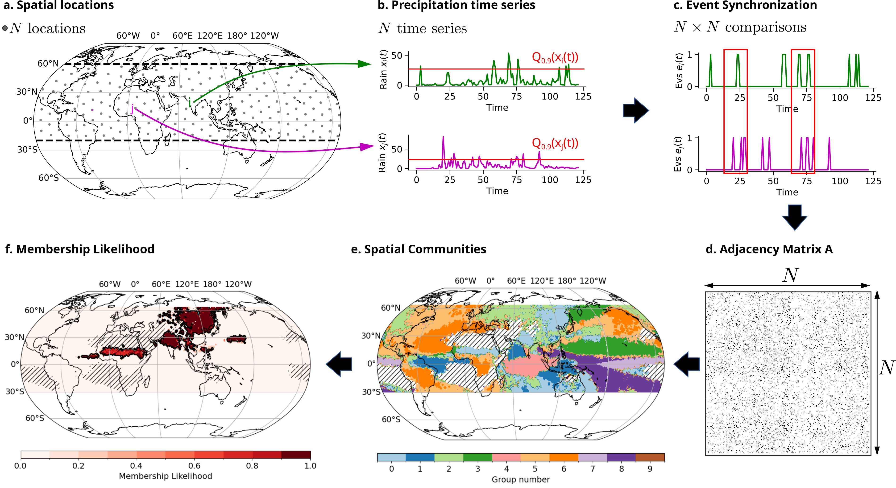

[](https://doi.org/10.5281/zenodo.8233579)


# Intraseasonal synchronization of extreme rainfalls between North India and the Sahel
We apply community detection on climate networks of Extreme Rainfall Events (EREs) to determine their intraseasonal variability.

An intuition on network community detection is given by:
***

***

## Clone the repo and install all required packages

### 1. Clone repository with submodules:
```
git clone --recurse-submodules git@github.com:fstrnad/monsoon_synchronization.git
```

### 2. Installing packages
To reproduce our analysis described in the paper follow these steps:
We recommend creating a new environment and installing all required packages by running:
```
conda env create -f submodules/climnet/condaEnv.yml
conda activate climnetenv
pip install graphriccicurvature
pip install -e submodules/geoutils
pip install -e submodules/climnet
```

### 3. Download data
Download Precipitation data from [MSWEP](http://www.gloh2o.org/mswep/). Regrid the file to 1°x1° daily resolution (e.g. by using the [geoutils](https://github.com/fstrnad/geoutils) package) and store the merged file in the data folder.

## Reproduce plots

1. Create the corresponding dataset and graph
```
python bin/create_ds.py
python bin/create_network.py
python bin/lb_net.py
python bin/cut_network.py
python bin/communities.py
```
The networks and community files are created and stored in 'outputs/'. They are used for the paper plots later.

2. Reproduce plots in the paper by running
```
python bin/paper_plots.py
```


The figures should look somehow similar to the following:

***


***


***


***


